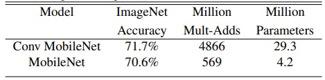
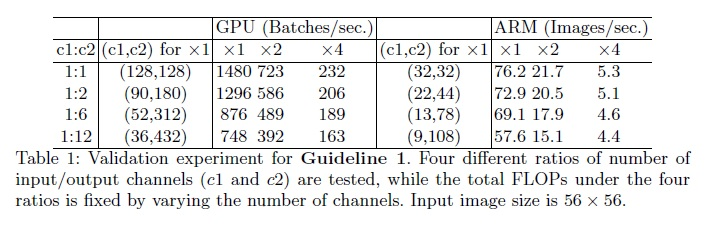

# Convolution layer 경량화 V1
모바일 디바이스 같이 메모리/연산능력의 한계가 존재하며, 실제 많은 레이어와 파라미터로 구성된 모델을 탑재하기는 어려운 실정이다. 2017년을 기점으로 해서 __모델 경량화__ 관해서 많은 연구가 진행되었고, 대표적인 연구결과 및 모델에 대해 정리해 보려고 한다.

이번 포스트에서 다룰 모델은 다음과 같다.  
- [Xception](#xception,-2017)  
- [MobileNets](#mobilenets,-2017)
- [Squeeze-and-Excitation Network (SENet)](#squeeze-and-excitation-network-(SENet),-2018)
- [ShuffleNet](#shufflenet,-2017)
- [CondenseNet](#condensenet,-2018)
- [MobileNets V2](#mobilenets-v2,-2018)
- [ShuffleNet V2](#shufflenet-v2,-2018)

  

## [Xception, 2017](https://arxiv.org/pdf/1610.02357.pdf)
---
구글에서 발표한 논문으로 경량화 자체에 대해 언급한 논문은 아니나, Inception 모듈을 __Depthwise seperable convolution__ (Depthwise convolution + pointwise convolution)과 같은 맥락으로 해석할 수 있음을 보여 주었으며, 동일한 파라미터 크기를 모델로써 Inception V3보다 더 나은 성능을 도출하였기에, 본 포스트에 언급하도록 하겠다.

아래 그림에서 보면, Inception module의 간단 버젼 [Fig. 1-(a)] 에서 3x3 convolution으로 통일시키고 및 Avg. Pool을 제거한 뒤 [Fig. 1-(b)], 1x1 convolution을 개념적으로 하나로 통일해서 생각하면 [Fig. 1-(c)], 이후에 적용되는 3x3 convolution는 output channel간의 겹치지 않고, 독립적으로 동작한다고 볼 수 있다. 만약 극단적으로 모든 채널에 대해 spatial correlation을 분리해서 본다면 [Fig. 1-(d)], 이는 결국 __Depthwise separable convolution__ 와 거의 같은 형태를 띄게 된다.
  

  
결국, 극단적으로 Inception 모듈을 구현 하였다고 볼 수 있어서 (extreme inception), 제안하는 모델 구조를 __Xception__ 이라고 부르게 된다.

Depthwise seperable convolution과는 두가지 관점에서 약간 차이가 있는데, 다음과 같다. 
1. 연산 순서
1. 비선형 연산 존재 유무  

논문에서는 연산순서의 경우 크게 고민을 하지 않았는데, 그 이유는 우리가 모델을 구성할때, 여러 모듈을 겹겹히 쌓게 되고 자연히 1x1->3x3->1x1->3x3...의 순서가 나타나게 되서 큰 차이가 없다고 판단했다.

하지만, 비선형 연산의 유무의 경우 두모듈에서  큰 차이점을 보여주게 되는데, 비선형을 제거할 수록, 다시 말해 ReLU연산을 제거 하면, 더 좋은 성능을 얻을 수 있게 되었다. 이는 Szegedy 가 주장과 상반된 결과 인데, 본 논문에서는 그 차이가 feature space의 깊이 (feature space의 채널 크기)에  인한 것으로 생각된다고 말한다 (Depthwise seperable convolution은 깊이가 1)
  

  

기본적으로 Depthwise seperable layer을 겹겹히 쌓고, 더불어 residual connection을 추가하였으며, Entry flow/Middle flow/Exit flow 세가지 모듈을 이용해 아키텍쳐를 구성하였다. 성능은 당연히 비교 대상인 Inception V3 보다 잘 나왔는데, ImageNet 데이터 [Fig. 3] 결과와 더불어 JFT 데이터 결과에서 모두 나은 정확도를 보여줬다.
  

  

본 논문은 Depthwise seperable convolution을 Inception 모듈 관점에서 재해석 하였고, 이를 통해 Depthwise seperable convolution의 효용성에 대해서 확인 할 있었다. 더불어, 필수적으로 사용되고 있었던 Nonlinear activation 사용에 대해서도 한번 더 고민하게 만드는 계기가 되었다.
  

## [MobileNets, 2017](https://arxiv.org/pdf/1704.04861.pdf)
---
2020년 11월 기준 인용수가 무려 5,000이 넘을 정도로 많은 연구자들이 인용한 논문으로써, 향후 많은 논문들에서 채택한 Depthwise seperable layer을 이용해 경량화를 효율적으로 보여준 연구이다.

앞서 언급했듯이, MobileNets 에서 경량화의 핵심은 바로 Depthwise seperable convolution으로 아래 그림에서와 같이 Batch Normalization과 ReLU을 같이 조합해 구성되었다.
  

  
일반적인 convolution layer와 연산량 비교를 해보면, 아래 그림에서 알 수 있듯이, 약 kernel 크기의 제곱만큼 연산량의 감소를 이룰 수 있다. 일반적으로 3x3 kernel을 많이 사용하기에, 약 9배정도의 연산량이 감소된다.
  

  

한가지 흥미로운 점은, 논문에서는 단순히 Multi-Adds (FLOPS)로 연산량의 이론적 감소 뿐만 아니라 실제 구현 관련해서도 고민을 했다. 실제 구현에서 연산 속도 향상을 위해서는 general matrix multiply (GEMM) 함수 활용을 해야하는데, 1x1 pointwise convolution은 memory상 재정렬 같은 상황을 고려하지 않고, 바로 GEMM을 이용해 구현이 가능하다는 것이다. 이는 1x1 pointwise convolution이 전체 연산량의 약 95%, 전체 파라미터의 약 75을 차지하며 주된 연산이 되기에, MobileNets의 실제 구현에서 최적화가 매우 잘 이뤄질 수 있음을 간접적으로 보여준다.

이 연구에서는 기존 모델과 비교해 어느정도까지 작은 모델을 만들 수 있고, 실질적으로 그에 따른 정확도와의 정량적 분석을 위해, 두가지 scale factor 개념을 소개했다
- __width multiplier__: convolution layer의 node 갯수 비율 (0~1)
- __resolution multiplier__: 입력 이미지의 축소 비율 (0~1)

위의 scale factor의 변경를 통해 실제 모델의 파라미터/연산량이 어떻게 바뀌고, 그에 따른 정확도는 어떻게 변화되는지를 확인 할 수 있다.

ImageNet 데이터에 대해서 같은 구조에 일반적인 convolution와 Depthwise seperable convolution을 적용한 경우 파라미터와 연산량은 약 8~9배 감소한 것 대비 정확도는 1%정도 밖에 열화 되지 않았다.
  

  

또한 Fine Grained Recognition, Large Scale Geolocalizaton, Face Attributes, Object Detection,  Face Embeddings 같은 다양한 task에 대해 MobileNets을 적용한 결과 기존의 baseline 모델 대비 동등한 성능을 보여주었다.
  

## [Squeeze-and-Excitation Network (SENet), 2018](https://arxiv.org/pdf/1709.01507.pdf)
SENet은 convolution features들의 채널간 inter-dependency을 모델링 하기위해 add-on 형태의 네트워크를 제안한 논문이다. 언뜻보면 모델 경량화와 관련이 없는 것처럼 보이지만, 기존의 Network에 미미한 수준의 추가 리소스를 요구하는 SENet 모듈을 추가함으로써, 성능을 비약적으로 향상 시킬 수 있다는 점에서, 본 연구는 경량화와 관련이 있다고 생각 할 수 있다.

  

  
위 그림은 SENet 구조를 도식화한 그림이다. Convolution layer ($F_{tr}$)후에 Squeeze 모듈과 Excitation 모듈을 차례로 적용하고, 이를 통해 생성한 scale vector을 출력 $U$에 적용(channel-wise multiplication)한다. 두 모듈에 대해 설명하자면, 다음과 같다.

Squeeze: Global information Enbedding
- 채널간의 dependency을 이용하기 위한 채널 aggregation 로직 
- 일반적으로 마지막 convolution layer을 제외하고, 각각의 convoluition layer의 출력들은 대부분 local receptive field로 부터 학습됨 → 하지만 이러한 특징으로 field 밖의 contextual 정보를 이용하기 어려움
- 본 연구에서는 단순히 __Global average pooling (GAP)__ 을 적용하여 squeeze 모듈 구현 (복잡한 구조도 적용 가능하지만, GAP만으로 충분)

Excitation: Adaptive Recalibration
- 채널간 dependency을 효과적으로 잡기 위해 sigmoid activation을 이용한 간단한 gating 매커니즘 적용
- bottleneck 형태의 두 개의 fully-connected (FC) layer 적용: dimensionality-reduction ratio $r$ 
- Bottlenck 구조의 사용이유는 모델의 complexity을 제한하고, 또한 generalisation에 도움이 되기 위함
- 이렇게 구해진 출력은 convolution layer 출력의 re-scaling 활용: __결국 이는 채널의 self-attention function으로 생각 가능__

하지만, 이렇게 추가되는 모듈로 인해 연산량/메모리 사용량이 많이 늘어난다면, 실제 활용성에서 떨어질 수 밖에 없다. 본 연구에서는 성능과 이러한 리소스 사용량 증가에 대해 매우 좋은 trade-off가 있음을 보여준다.

본 연구에서는 ResNet-50과 SENet이 적용된 SE-ResNet-50과의 비교를 진행하였는데, 우선 연산량 관점에서 보면 다음과 같다
- ResNet-50: 3.86 GFLOPs, SE-ResNet-50: 3.87 GFLOPs (0.26% 증가, $r$=16기준) → 하지만 정확도는 ResNet-101에 근접 (7.58 GFLOPs)
- 실제 CPU inference 시간을 측정해보면, 224x224 이미지 기준으로, ResNet-50: 164 ms, SE-ResNet-50: 167 ms 으로 약간의 속도 저하

파라미터 증가로 인한, 메모리 사용량 관점에서 보면, 
- 2.5 million 증가 (ResNet-50의 10% 수준)
- 하지만, 대부분 마지막 layer (채널이 매우 많음)의 SENet 모듈로 부터 비롯된 것이라 이를 적용하지 않으면 약 4% 증가 (성능 열화는 ImageNet top-5 에러 기준 0.1% 수준)

결국 적절한 SENet 모듈을 기존 CNN 네트워크에 추가해줌으로써, 약간의 추가 리소스 사용으로 높은 성능 향상을 이룰 수 있다는 것이 본 연구에서 주장하는 바이다.

다양한 실험에서 SE Block의 효용성을 확인 할 수 있었다. Image classification, Scene Classification, Object detection 등에서 기존의 ResNet 기반 모델 대비, SE block을 추가한 경우 대부분 성능 향상을 확인 할 수 있었다. (자세한 성능 수치는 논문을 참고)

본 연구에서는 몇가지 부분에서 ablation study을 진행했는데, 다음과 같다.
- Reduction ratio (r)
  - r 이 크지 않은 경우 의외로 성능의 큰 변화가 보이지 않았다. 이에 r=16을 가장 좋은 balamnce을 보여주었기에 선택 (주어진 모델에 따라 달라질 수 있는 부분이라, 이는 튜닝 포인트)
- Squeeze Operator
  - AvgPool, MaxPool을 비교
  - AvgPool이 조금 더 좋은 성능 향상을 보여주나, MaxPool도 사용가능
- Excitation Operator
  - ReLU, tanh 그리고 sigmoid(현재 사용)을 비교
  - sigmoid가 가장 좋은 성능 보여줌. ReLU의 경우 성능 열화가 심함. Activation function 선택이 중요
- Different stage
  - ResNet-50에서 여러 위치별 SE block을 삽입해 성능 평가
  - 모든 위치에서 성능 향상을 보여줌
- Integration strategy
  - Residual unit의 앞에, 뒤에 혹은 동일한 형태로 삽입
  - 뒤에 삽입한 경우만 성능 열화가 있고, 그외 경우는 준수한 성능을 보여줌
## [ShuffleNet, 2017](https://arxiv.org/pdf/1709.01507.pdf)
ShuffleNet은 ResNet 기반에 group convolution과 channel shuffle이라는 방법을 도입하여, 계산이 효율적인 CNN 구조를 제안한 방법이다. 

### Group convolution
이미 AlexNet에서 group convolution의 개념을 소개했었는데 당시에는 부족한 GPU 자원을 사용하기 위해 궁여지책으로 사용했다고 한다면, ResNext에서 그 효용성이 잘 드러나게 되었다. ShuffleNet에서도 마찬가지로 이러한 group convolution을 사용하는데, 한가지 특징은 MobileNet에서 사용한 Depthwise seperable convolution과 함께 사용하여 그 효과를 극대화 하였다.

### Channel shuffle
Group convolution은 한가지 문제가 발생하게 되는데, 그룹마다 본인 그룹에 관련된 입력에 대해서만 연관되어 출력을 표현하게 되고, 이는 채널간 정보의 흐름을 오히려 막게 되어, 모델이 제대로된 표현을 방해하게 된다. 이를 위해 
그룹간 채널을 셔플링 하는 작업을 넣게 되는데, 이를 통해 모든 채널에 대해 입력과 출력이 모두 연관되도록 할 수 있다.

아래 그림에 Group convolution과 channel shuffle을 잘 나타내고 있다. 한가지 주목할 점은, channel shuffle의 경우 아주 간단한 연산을 통해 구현이 가능한데, group convolution을 통해 얻어진 $N(=g \times n)$개 채널의 출력을 먼저 $(g, n)$ 형태로 __reshape__ 을 하고, 이후 __transposing__ 및 __flattening__ 연산만 해주면 간단히 channel shuffle을 구현할 수 있다. 이러한 연산은 특히 그룹간 채널수가 달라도 문제가 없을 뿐만 아니라, 미분이 가능하기에 end-to-end 학습에도 적용 가능하다
  

  

### ShuffleNet Unit
저자들은 기본적인 shufflenet unit을 제안하는데 이는 아래 그림과 같다.
  

  
ResNet bottleneck 구조에서 출발하는데, 구조의 변경을 다음과 같이 진행했다.
- $3 \times 3$ depthwise convolution 변경
- $1 \times 1$ group convolution 변경 및 channel shuffle 추가
- $3 \times 3$ depthwise convolution 의 ReLU 제거 ($\because$ Xception에서 설명)

Stride와 같이 사용하는 경우, 즉 feature 면적 크기가 줄어드는 경우에 대해서도 Unit을 제안하는데, 다음과 같이 2가지를 변경하면 된다.
- $3 \times 3$ AVG pooling을 shortcut path에 추가
- element-wise addition을 channel cocatenation으로 변경

이러한 shufflenet unit을 활용해서, 전체적인 shufflenet 구조를 저자들은 제안하는데 아래 표와 같다
  

  
3단계에 걸쳐 shufflenet units을 겹겹히 쌓아서 구성하였고, 각 stage 처음에는 stride=2을 적용하였고, 다음단계로 넘어 갈때 마다 이부분을 감안해 채널 수를 두배로 키워주었다. 

저자들은 또한 group number $g$의 변화를 통해 성능 향상을 보여주려 했는데, group number을 크게 할 수록 결과적으로 동일한 complexity에서 네트워크가 많은 채널을 가지게 된다. 이는 보다 많은 정보를 담을 수 있게 되고, 곧 성능 향상을 가져온다. 결국 __"주어진 complexity안에서 채널 크기를 충분히 확보할 수 있고 이는 결국 성능 향상으로 연결된다"__ 는 점이 바로 shufflenet의 가장 큰 성과이지 않나 생각된다.

저자들은 ImageNet 데이터셋에서 shufflenet이 훨씬 적은 연산량을 사용하고도 높은 성능을 보여줌을 보여준다. 또한 COCO dataset을 이용한 Object detection task에서도 MobileNet 대비 더 좋은 성능을 보여주는 것을 보여줌으로써, 본인들이 제안한 네트워크의 효용성을 잘 어필했다.(자세한 성능은 논문 참고)

마지막으로 저자들은 실제 ARM platform을 가지는 mobile device에 shufflenet 모델을 deploy하여 inference 속도를 체크하였다. $g=3$을 기준으로 테스트 해보았을 때, 메모리 엑세스 및 추가적인 오버헤드로 인해 이론적인 연산량 감소 수치 대비 실제 낮은 속도 향상은 보여주었지만, 유사한 성능 내는 Shufflenet 0.5x 기준으로 AlexNet에 대비 13배 빠른 속도를 보여주었다. 속도 향상 결과도 당연히 놀랍지만, 실제 mobile device에 deploy해서 속도 측정까지 했다는 점에서 저자들의 노력이 돋보이는 대목이다.
## [CondenseNet, 2018](https://arxiv.org/pdf/1711.09224.pdf)

## [MobileNets V2, 2018](https://arxiv.org/pdf/1801.04381.pdf)
---
2017년에 이어 구글 개발진은, MobileNets v2 을 발표하면서 경량화 관점에서 더 최적화된 구조를 제안하였다. MobileNets v1에서 핵심인 Depthwise seperable convolution은 여전히 사용하는 대신, 구조적인 면에서 새로운 개념을 제시하였다.
- Linear bottlencks
- Inverted residuals

우선 Linear bottlenecks 구조는 Covolution layer 구조 설계시 당연시하게 사용되는 ReLU 연산에 대한 고찰에서 출발하였다.  논무에서는 __manifold of interest__ 개념을 기반으로 설명하는데, 이는 우리가 다루는 layer activations 의 subset이라고 생각하면 된다. 

딥러닝 모델을 통해 이러한 Manifold of interest의 경우는 효과적으로 low-dimensional subspace로 임베딩이 가능하고, 이를 통해 높은 성능을 발휘 할 수 있는데, 이러한 부분에 있어 ReLu 연산을 사용할 경우 두가지 관점에서 고민을 해야 한다.
  1. ReLU 변환 후 manifold of interest가 여전히 non-zero volumn에 있다면, ReLU연산은 linear transform과 일치한다.
  1. 입력 manifold가 입력 공간의 low-dimensional subspace에 놓여야지만, ReLU연산은 온전히 정보를 보전할 수 있다.

참으로 헷갈리는 말이다... 아래 그림을 살펴보면, input manifolds을 충분히 담지 못하는 space에서 ReLU 연산을 적용하면, 정보 손실이 발생하지만, 충분히 큰 space로 relu 함수를 적용하면, 그 손실의 양이 적다는 것을 알 수 있다.
  

  

따라서  저차원에서 ReLU을 적용하게 되면 nonlinearity로 인해 많은 정보를 잃게 되기 때문에 (실험적으로 확인), __Linear bottleneck__ layer을 구성해야 된다는 것이다.

그렇다면, ReLU는 이대로 없애버리는 것일까? 아니다. ReLU의 경우 사실상 모델에 nonlinearity을 추가해, 우리가 원하는 결과에 대해 모델이 좀더 잘 묘사할 수 있는 역할을 하는데, 이를 없애자는 것은 꺼려지기도 할 뿐 아니라 ReLU을 사용하는 그간의 모든 연구를 부정하는 것이 될 수 도 있다 (너무 극단적으로 생각하긴 했다...)

어쨌든, 논문에서는 이러한 모델의 nonlinearity을 유지하기 위해 Inverted residual이라는 개념을 가지고 왔는데, 아래 그림과 같다.
  

  

1x1 convolution 이후, expansion factor을 도입해 채널을 확장한 뒤, depthwise seperable convolution을 수행하고, 다시 차원을 줄여준다. 차원이 확장되었을 때는 ReLU activation을 적용하였고, 마지막에 차원이 줄어들었을 때는 activation을 적용하지 않았다. 궁극적으로는 이러한 구조를 통해 연산량은 기존대비 작게 유지하지만, 실제 성능은 오히려 더 향상되는 결과를 가져왔다.

한가지 더 살펴 볼것은 ReLU대신 ReLU(6)을 사용한 것인데, 이는 모바일 디바이스에 적합하도록 Fixed-point precision으로 모델 파라미터를 변경할 때, 보다 Robust한 결과를 얻는데 도움이 된다. 즉, high-precision 연산 모델 대비 low-precision 연산 모델의 성능 열화를 줄일 수 있다.

ImageNet Classification,  Object Detection,  Semantic Segmentation 등 이미지 처리관련해서 다양한 task에 대해 성능 평가를 했는데, 기존 MobileNet v1 대비 향상된 성능을 보여줬을 뿐만 아니라, ShuffleNet, NasNet 등과 비교해서도 우위를 보여줬다. 

특히, Object Detection에서 SSDLite (Single Shot Multibox Detector Lite)와 조합해서 YOLOv2 대비 1/10 수준의 파라미터와 1/20 수준의 연산량을 사용하고도 오히려 높은 성능을 도출하였다는 점에서 인상깊었다.

## [ShuffleNet V2, 2018](https://arxiv.org/pdf/1807.11164.pdf)
ShuffleNet V2에서는 경량화 관련해서 보다 현실적인 면에 집중하기 시작한다. 기존의 많은 모델 경량화 논문들은 부동소수점 연산 갯수 (FLOPs) 을 기준으로 모델의 연산 능력을 평가하였는데, 이는 실제 디바이스에 deploy하고 나서 속도 및 지연시간(latency)와 정확히 매칭되지 않는다.

이론적인 연산량과 실제 구현에서의 차이는 다음의 두가지 이유에서 기인한다.
1. __메모리 접근 비용__ (memory access cost, MAC) 및 병렬화 정도  
   - Group convolution의 경우 GPU 연산시 bottleneck이 됨
1. __동작하는 platform__  
   - Tensor decomposition 오히려 CUDNN library을 이용한 GPU 연산에서 ($3 \times 3$ 연산에 최적화) 오히려 연산 속도의 감소를 가지고 옴. 

저자들은 이러한 부분에 집중하여, 효율적인 네트워크 디자인을 위한 4가지 가이드라인을 제시하고, 이를 기반으로 기존 Shufflenet을 개선한 Shufflenet v2을 소개한다.

### __1. MAC 을 최소화 하기 위해 채널 크기 일치__
저자들은 수학적으로 MAC을 정의하는데, 이는 다음과 같다
$$ MAC = hw(c_1 + c_2) + c_{1}c_{2}$$
여기서 $h$와 $w$의 feature map의 spatial size이고, $c_1$과 $c_2$는 각각 입력, 출력 채널 크기이다. 평균값 정리를 정의하면, 위식은 다음과 같이 표현 가능한데,
$$ MAC \geq 2 \sqrt{hwB} + \frac{B}{hw} $$
여기서 $B = hwc_1 c_2$ 로 $1 \times 1$ convolution의 FLOPs이다.

결국, 이론적으로 생각해보면, $c_1$ 과 $c_2$가 같을 때, MAC는 최소가 되고, 실질적인 속도 향상을 가지고 올 수 있다. 저자들은 GPU  (GTX1080ti) 와 ARM (Qualcomm Snapdragon 810) 에서 입출력 채널 크기의 비율을 변경해가면서 속도 측정을 하였고, 성능은 이론적으로 예상한 바와 두 채널의 크기가 같을 때 가장 성능이 우수했다.
  

  

### __2. Group convolution 으로 인한 MAC 증가가 발생__
ResNext, shufflenet 에서 주요 성능 향상의 key였다 group convolution의 경우 기존의 dense convolution 보다 FLOPs을 줄이며, 오히려 많은 채널 사용을 가능하게 하여 모델의 성능을 높였었다. 하지만 MAC 관점에서 이는 오히려 역효과를 가지고 온다.
$$ MAC = hw(c_1 + c_2) + \frac{c_1 c_2}{g} = hwc_1 + \frac{Bg}{c_1} + \frac{B}{hw} $$
여기서 $g$ 는 group 갯수를 의미하고, $B=hwc_1 c_2 /g$ 로 FLOPs을 의미한다. 동일한 FLOPs ($B$) 을 유지한다고 생각해 보면, $g$의 값이 증가하면 할 수록, MAC는 증가하게 된다. 결국 Group convolution의 경우 traget platform과 task에 따라 신중하게 선택되어야 한다.
  

  

### 3. __Network fragmentation은 병렬화를 방해__
GoogleNet 시리즈와 NAS 를 통해 만들어진 네트워크에서는 "multi-path" 구조를 많이 채택하였다. 큰 하나의 operation이 아닌 여러개의 작은 opeartions을 활용하게 되면, 정확도 관점에서 많은 이득을 보여줬다. 하지만 GPU와 같은 강력한 병렬화를 지원하는 상황에서 이러한 "파편화된" 연산은 오히려 효율성을 떨어뜨린다. 실제 kernel 실행과 동기화에 많은 overhead가 발생하기 때문이다.

저자들은 이러한 부분을 실험적으로 검증하기 위해, 1~4 단계로 $1 \times 1$ convolution을 파편화해 보았다. 아래 그림에서 확인할 수 있듯이 파편화된 구조에서 GPU의 경우 성능 열화가 심하게 발생하는 것을 확인 할 수 있다. 반면에 CPU 연산만 주로 사용하는 ARM 에서는 상대적으로 이러한 열화가 심하지 않았다.
  

  

### 4. __Element-wise 연산은 무시할 수 있는 수준이 아님__
실제 ReLU, Add Tensor, Add Bias와 같은 element-wise operation은 작은 FLOPs을 가지지만, 실제 구현에서는 높은 MAC을 가진다. MobileNet과 ShuffleNet에서 약 5~20% 정도의 runtime 시간을 차지할 정도로 큰데, 특히 GPU연산에서 많은 부분을 차지한다.
실제 ResNet BottleNet 구조에서 이 부분을 실험해 본 결과 ReLU 연산과 shortcut을 제거한 것 만으로 아래표에 나타났듯이 약 20% 의 속도 향상을 이뤄냈다.
  

  

### __Guideline에 맞게 설계된 shufflenet v2__
  

  

shufflenet v2의 경우 어떻게 shufflnet v1에서 제시된 guideline에 따라 변경되었는지 확인해보자
1. 먼저 시작에 channel split을 적용 (group convolution의 효과를 완전히 무시할 수는 없으니)
1. G3 기준으로 하나의 branch는 특별한 연산 없이 shortcut으로 연결. (파편화된 계산을 막기 위해)
1. G1 기준으로 다른 branch에서는 입력과 출력의 크기를 일치
1. 두 branch 결과의 concatenation 후, shufflenet v1에서 핵심이 었던 channel shuffle을 적용
1. 이후 바로 다음 unit과 합쳐진다, 합쳐진 두 unit을 통해 보면, "Concat", "channel shuffle", "channel split"이 하나의 element-wise 연산으로 합쳐 지고 이는 결국 G4 기준으로 element-wise 연산 전체 갯수를 줄이는 효과를 가지고 옴
1. Spatial downsampling의 케이스는 약간의 변형을 통해 유사하게 만들 수 있다. (위 그림 (d))

Shufflenet v2는 연산 효율뿐만 아니라 정확도 관점에서도 향상을 도모 할 수 있다고 저자들은 주장하는데, 2가지 이유를 제시하고 있다.
1. 효율적인 구조로 인해 보다 큰 feature 채널 갯수를 사용하게 됨
1. Channel split로 절반은 바로 다음 block으로 연결되는 효과가 있음 → 이는 DenseNet이나 CondenseNet에서 말하는 핵심 원리인 feature reuse와 관련

여느 논문들과 마찬가지로 ImageNet 데이터에 대해 다른 모델들과 성능 평가를 진행하였다. 이전 모델인 shufflenet v1, 경쟁자인 MobileNet v2, Xception 그리고 DenseNet과 성능 비교를 진행하였다. Shufflenet이 정확도 면이나 Inference 속도 면에서 위의 다른 모델보다 성능이 우수했다. 한가지 흥미로운 점은, 성능 평가시 MobileNet v2 대비 향상된 부분을 많이 강조하는데, 역시 두 모델간 경쟁심리를 엿볼 수 있었다.

단순히 경량화 관점 뿐만 아니라, SENet과 같은 추가 모듈과의 호환성도 좋음을 보여주었고, 또한 Object detection task에서의 성능도 우수함을 보여줌으로써, classfication에 한정된 것이 아닌, 일반적인 task에서도 좋은 성능을 낼 수 있음을 간접적으로 보여주었다.

경량화와 관계없이 한가지 실험 말미에 언급한 부분이 있는데, Object detection task에서 Xception이 shufflenet v1과 mobilenet v2 보다 좋은 성능을 보여주었는데, 저자들은 그것이 훨씬 더 큰 receptive field을 사용했기 때문이라 생각했다. 실제  shufflenet v2에서도 $3 \times 3$ depthwise convolution을 더 추가해서 receptive field을 키우니 정확도가 더 올라갔다고 한다. object detection task에서 receptive field의 중요성을 단적으로 보여주는 예가 아닌가 싶다.

