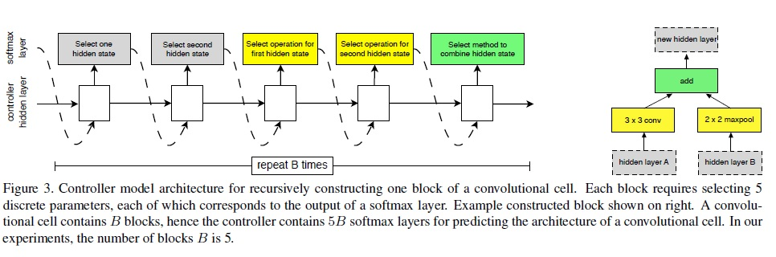

# Convolution layer 경량화 V2
이번 포스트는 지난 Convolution layer 경량화 V1 에 이어서 몇몇 연구 결과를 설명할 계획이다. 앞서 다룬 방법과 달리 __AutoML__ 을 이용한 __Neural Architecture Search (NAS)__ 기반 논문을 소개하려 한다.

- [NASNet](#nasnet,-2018)
- [PNASNet](#PNASNet,-2018)  
- [AmoebaNet](#AmoebaNet,-2019)    
- [MnasNet](#MnasNet,-2019)  
- [ENAS](#ENAS,-2018)  
- [DARTS](#DARTS,-2019)
- [MCUNet](#MCUNet,-2020)    

  

## [NASNet, 2018](https://arxiv.org/pdf/1707.07012.pdf)
[NEURAL ARCHITECTURE SEARCH WITH REINFORCEMENT LEARNING](https://arxiv.org/pdf/1611.01578.pdf) 에서 Reinforcement learning을 이용하여 최적의 architecture을 찾는 프레임워크를 제시하였다. 하지만 ImageNet과 같은 큰 데이터셋에 이러한 방법을 그대로 적용을 하면, 계산 비용이 많이 들게 된다.

본 연구에서는 "NASNET search space" 라는 새로운 search space 디자인 함으로써 transferability을 가능케 하여 계산 및 속도 문제를 해결하려 했다. 즉, 작은 데이터셋(ex. CIFAR-10)에서 최적화된 archtectural block을 찾고 이를 큰 데이터셋(ImageNet)에 적용시키는 것이다.

저자들은 이러한 개념을 위해 동일한 구조를 가지는 convolution cell (weight는 다름)을 구성하였다. Inception과 ResNet과 같은 그간의 연구들을 토대로 생각해보면, 동일한 혹은 유사한 구조의 cell들이 반복적으로 쌓아 좋은 성능을 내었었다. 본 연구에서는 이러한 내용을 착안해서, best CNN cell을 찾는 것을 목표로 하여 architecture 학습을 진행하였다.

이러한 방법은 두가지 관점에서 의미가 있는데, 우선 속도 관점이다. 아무래도 전체 network architecture을 다 검색하는 방법보다는 훨씬 빠를 수 밖에 없다. 또한, cell 단위로 찾는 것이기에 다른 문제에 적용하더라도 좀 더 general한 결과를 도출화 할 수 있게 된다.

크게 두가지 타입의 CNN cell이 제시되는데, 다음과 같다
- Normal Cell
  - 입력 feature map과 같은 크기의 출력을 내는 CNN cell
- Redcution Cell
  - 입력 feature map 대비 가로-세로가 절반으로 줄어든 출력을 내는 CNN-cell (stride 2 적용)
  - 경험적으로 봤을 때, Reduction cell에서 filter 갯수는 2배로 늘려줌 → 일정한 hidden state 크기를 유지 가능

위 두가지 타입의 CNN cell을 반복적으로 쌓아줌으로써, 전체 네트워크를 구성한다.

각각의 Normal cell과 Reduction cell은 RNN controller을 이용해 reinforcement learning을 통해 학습된다. 이는 NEURAL ARCHITECTURE SEARCH WITH REINFORCEMENT LEARNING에서 적용한 방법과 동일하다. 아래 그림에 CNN block을 생성하는 방법을 나타내었다.

Cell에서는 이전 layer에서 출력된 두개의 hidden state $h_i% 와 $h_{i-1}$을 초기 입력으로 받고, 이 hidden state을 기반으로 RNN controller는 CNN cell의 구조를 prediction 한다. 이 prediction은 block단위로 이뤄지는데, 각 block마다 5개의 prediction이 있고 이는 다음과 같다.
1.  $h_i%, $h_{i-1}$, 또는 이전 block의 hidden state 중 하나 선택 (첫번째 hidden state)
2. 마찬가지로 두번째 hidden state 선택
3. 첫번째 hidden state에 적용되는 operation 선택
4. 두번째 hidden state에 적용되는 operation 선택
5. 3,4의 출력을 combine하는 방법 선택

3,4에 적용되는 operation은 CNN 분야에서 주로 사용되는 구조를 채택하는데, 다음과 같다
- identity 
- 1x3 then 3x1 convolution
- 1x7 then 7x1 convolution
- 3x3 dilated convolution
- 3x3 average pooling
- 3x3 max pooling
- 5x5 max pooling
- 7x7 max pooling
- 1x1 convolution
- 3x3 convolution
- 3x3 depthwise-separable conv
- 5x5 depthwise-seperable conv
- 7x7 depthwise-separable conv

5에 적용되는 combine 하는 방법은 다음의 두가지 이다.
- element-wise addition
- cocatenation along the filter dimensions

$B$ block만큼 위의 prediction들이 반복되는데, 저자들의 실험에서는 $B$=5인 경우에 좋은 결과를 제공하였다. 또한, Normal cell과 Reduction cell을 모두 prediction 할 수 있도록, RNN controller는 총 $2x 5B$ 만큼의 prediction을 수행한다. 즉, 앞의 $5B$는 normal cell 그리고 뒤의 $5B$는 reduction cell용이다.

앞서 언급했듯이, 저자들읜 reinforcement learning 으로 RNN contoller의 parameter을 학습했는데, random search을 통해서도 architecture을 찾아 보았다고 한다. 당연하게도 성능은 떨어졌지만 흥미로운 점은 그 정도가 작은 편이였다는 것이다. 저자들은 이 결과를 토대로 조금은 성급한 일반화일지는 모르겠지만, 본인들이 제안한 NASNet search space가 매우 잘 설계된 것이고, Random search는 상당히 높은 수준의(이기기 쉽지 않은) baseline이라고 언급한다. (사실 확 와닿지는 않는다...)

------실험부터 읽어 보자

## [PNASNet, 2018](https://arxiv.org/pdf/1712.00559.pdf)

## [AmoebaNet, 2019](https://arxiv.org/pdf/1802.01548.pdf)

## [MnasNet, 2019](https://arxiv.org/pdf/1807.11626.pdf)

## [ENAS, 2018](https://arxiv.org/pdf/1802.03268.pdf)

## [DARTS, 2019](https://arxiv.org/pdf/1806.09055.pdf)

## [MCUNet, 2020](https://arxiv.org/pdf/2007.10319.pdf)