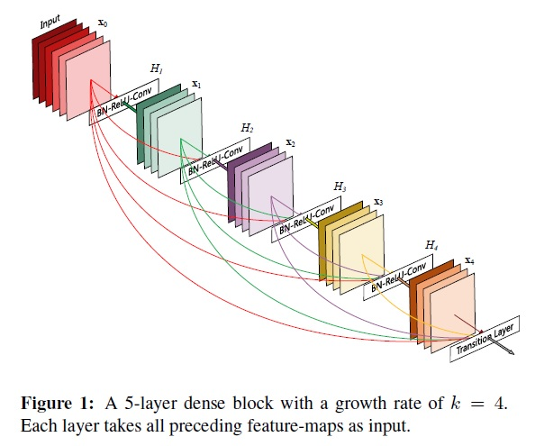
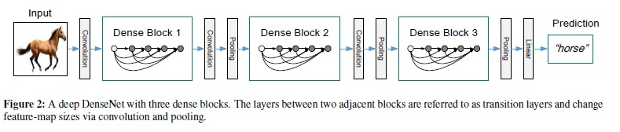

# ResNet 개선 논문 정리
2015년 ResNet 논문이 발표된 후, 가히 ResNet 전성시대를 맞이했다고 볼 수 있을 만큼 ResNet 기반 논문들이 발표 되었다.
본 포스트에서는 이들 중, 대표적인 것들 몇가지를 소개할 예정이다.

- [ResNext](#resNext,-2017)
- [Residual Attention Network](#residual-attention-network,-2017)
- [DenseNet](#densenet,-2017)
- [Dual Path Network](#dual-path-network(DPN),-2017)

## [ResNext, 2017](https://arxiv.org/pdf/1611.05431.pdf)

## [Residual Attention Network, 2017](https://arxiv.org/pdf/1704.06904.pdf)

## [DenseNet, 2017](https://arxiv.org/pdf/1608.06993.pdf)
DenseNet 은 ResNet과 마찬가지로 이전 layer의 feature map과 다음 layer의 입력과 연결(shortcut connection)해주는 방식을 채택하고 있다. 하지만 연결 방식에서 차이점이 존재하는데, 연속되는 두 layer에 대해서만 연결하는 ResNet과 달리, 뒤에 나오는 모든 layer에 대해 연결해 준다. 즉, ResNet의 경우 $N$개의 layer에 $N$개의 연결이 있다고 하면, DenseNet의 경우 $N(N+1)/2$ 개의 연결이 존재한다. 기존대비 훨씬 Densely 연결되어 있기에, DenseNet이라는 이름이 붙였다고 한다.

이외에도 한가지 특징이 더 있는데, Feature map간 shortcut 연결시 더해주는 ResNet과 달리 DenseNet에서는 concatenation 시킨다. 
아래 그림에 DenseNet block에 대해 잘 살펴 볼 수 있다.

저자들은 이런한 구조를 통해 다음과 같은 이점을 얻을 수 있다고 한다.
- Vanishing-gradient 문제 해결
- Feature propagation 강화
- Feature Reuse 활용
- Parameter 갯수 절약 (narrow한 layer 활용 가능)

DenseNet 에서 사용하는 구조에 대해 얘기해보면, 우선 Connectivity는 다음과 같이 수식으로 정의 할 수 있다.
$$ x_l = H_l ([x_0 , x_1 , ..., x_{l-1}]) $$
여기서 $x_l$은 $l$번째 layer feature map이고, $H_l$은 composite function이다. 즉, 이전 layer들의 feature map을 모두 concatenate 하여 현재 layer에 활용한다. Composite function $H_l(\centerdot)$ 은 batchnorm + ReLU + $3 \times 3$ Conv 연산으로 구성되어 있다. 

모델에서 down-sampling (pooling) 같은 연산을 사용하는데 있어, 위의 concatenate 연산은 장애가 된다. 그래서 저자들은 네트워크를 몇개 단위로 쪼개서 (dense block), 각 block 간의 연결하는 과정에서 pooling을 적용한다. 이를 _transition layer_ 라고 하는데 batchnorm + $1 \times 1$ Conv + $2 \times 2$ Avg pooling 으로 구성되어 있다.

DenseNet 에서는 _Growth rate (K)_ 라는 hyper parameter가 존재하는데, 이는 각 dense block 에 layer 마다 증가되는 채널 갯수를 의미한다. $l$번째 layer의 feature map 갯수는 $k_0 + k \times (l -1)$ 로 정의되는데, 여기서 $k_0$ 는 처음 입력 feature map 개수, 일반적으로 $k$는 작은 값 (ex, $k=12$)을 택할 수 있다. 저자들은 이러한 면에서 DenseNet이 narrow layer을 사용하고, 파라미터 수가 절약된다고 주장한다.

이를 해석해보면, 결국 이러한 연결을 통해 각각의 layer들은 네트워크 전체의 _Collective knowledge_ 을 전달 받게 된다. 각각의 feature map들은 RNN 처럼 마치 자기만의 state가 존재하고, Growth rate는 각각의 layer의 정보가 전체 state에 어느정도 반영될지를 결정하는 것이다. 또 다른 관점으로는, 네트워크 전체 state 정보가 어느 layer에서도 접근 가능하고, 이러한 특징으로 인해 Feature propagation이 수월하게 이루어진다고 볼 수 있다.

연산량 관점에서 효율성을 높이기 위해 DenseNet도 Bottleneck layer을 제안하는데, BN + ReLU + $1 \times 1$ Conv (feature 갯수가 줄어든) + BN + ReLU + $3 \times 3$ Conv 형태로 구성된 $h_l$ 을 만들었다.
또한, _Compression factor ($0 < \theta \leq1$)_ 라는 것을 정의해서 transition layer의 feature map 갯수를 줄임으로써, 모델을 좀 더 compact 하게 구성할 수 있다.

__실험__

## [Dual Path Network(DPN), 2017](https://papers.nips.cc/paper/2017/file/f7e0b956540676a129760a3eae309294-Paper.pdf)