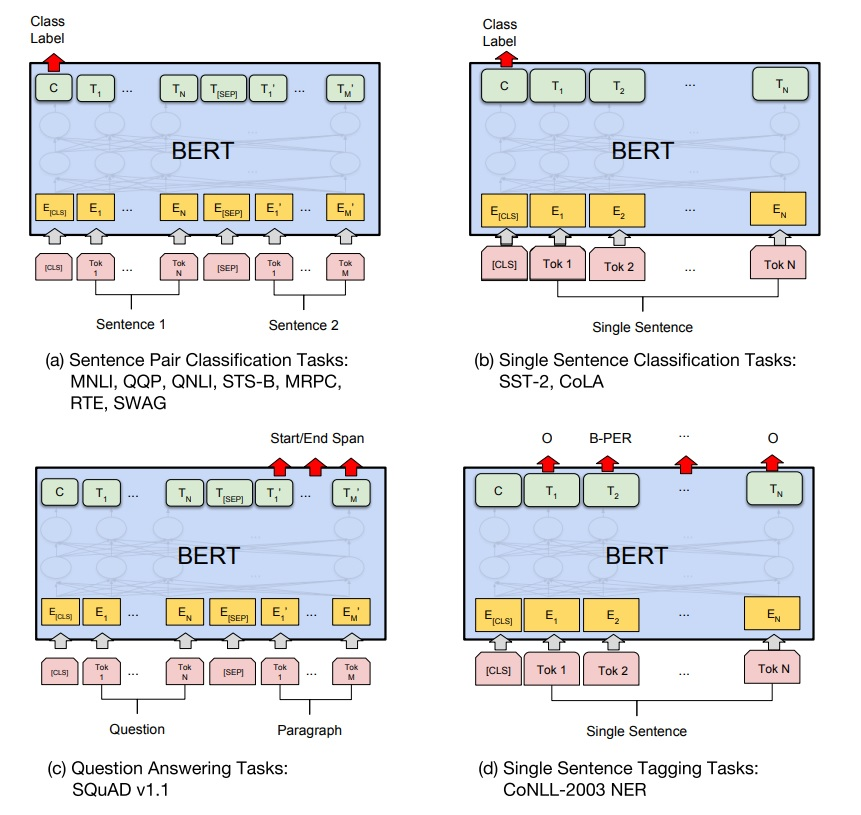

# BERT

제목: [BERT: Pre-training of Deep Bidirectional Transformers for
Language Understanding
](https://arxiv.org/pdf/1810.04805.pdf)

__BERT (Bidirectional Encoder Representations from Transformers)__ 는 구글에서 소개한 pre-trained language representation model로써, 다양한 language task들에서 한 두개의 layer만 추가한 뒤 fine-tunning을 통해 SOTA 성능을 달성케 하였다. 

BERT 이전에도 ELMo, OpenAI GPT와 같이 wiki나 book데이터와 같은 대용량 _unlabeled_ 데이터로 미리 학습한 뒤, 특정 task에 _labeled_ 데이터로 transfer learning을 하는 방식은 소개되었지만, BERT의 경우 __bidirectional__ 한 방법을 통해 좀 더 language representation 잘 하도록 구성하였다 

Unidirectional representation은 question answering 같은 token-level task에서 그 한계점이 보일 수 있는데, 이는 이러한 task들이 잘 수행되기 위해서는 앞뒤 문맥을 모두 파악하고 이해하는 작업이 중요하기 때문이다. 물론 ELMo의 경우, bidirectional representation을 구현하였지만, 깊이가 얕은(shallow) 구조에, feature-based 접근방식으로 fine-tunning 기반의 BERT와 차이점이 존재한다.

그럼 어떻게 "이전에는 왜 고려하지 못했을까?" 라는 의문이 가지게 된다. 사실 이전의 방법들에서 언어모델을 학습을 할 경우, 대부분 한 문장을 집어 놓고, 다음에 오는 단어/문장 등을 예상하도록 학습을 진행하였다. 이는 필연적으로 left-to-right 구조를 가질 수 밖에 없게 된다. 그럼 BERT는 이 문제를 어떻게 해결했을까? 바로 __Masked Language Model (MLM)__ 이다. 이 내용은 아래 다시 자세히 다루도록 하겠다.

## __Model Architecture__
BERT의 경우 transformer 중에서 encoder 부분만 사용한다. 논문에서도 언급했듯이, 이 부분에 대한 자세한 설명은  [Vaswani et al. (2017)](https://arxiv.org/abs/1706.03762)을 참고하기 바란다. 

논문에서는 모델 크기에 따라 두가지 버젼의 BERT을 제시하였다. 
- BERT BASE: L=12, H=768, A=12, Total Parameters=110M
- BERT LARGE: L=24, H=1024, A=16, Total Parameters=340M

BERT BASE의 경우, 당시의 주 경쟁자였던 OpenAI GPT와의 비교를 위해 구성하였는데, 실재 OpenAI GPT와 hyper-parameter도 동일하게 구성하였다. 이는 BERT에서 MLM 적용과 같은 pre-training의 변경을 통한 representation의 강화가 얼마나 성능향상을 이룰 수 있는지를 보여주기 위함이라 생각된다.

## __Input/Output Representations__
BERT는 [WordPiece embedding](https://arxiv.org/abs/1609.08144) 을 사용하였다. 매 문장의 첫 토큰의 경우 항상 __[CLS]__ 을 사용하는데, 이 [CLS] 토큰의 경우, transformer의 모든 layer을 다 지나고 나면, token sequence 의 전체 의미 (결합 의미)를 포함하게 되는데, 간단한 classification layer을 붙임으로써, 문장의 classification task을 쉽게 수행하게 된다.

또한, sentense pair 역시 __[SEP]__ 토큰을 활용하여 하나의 sequence로 만들고 transformer에 넣어주게 된다. 갑자기 sentense pair가 얘기가 나와서 당황스럽겠지만, BERT에서는 next sentence prediction (NSP) task을 동시에 추가해 줌으로써, pre-trained model이 Question answering (QA)이나 Natural Language Inference (NLI) 에도 좋은 성능을 도출 할 수 있게 한다. 

이러한 컨셉을 기반으로, 주어진 토큰에 Segment embedding과 posional embedding 을 추가하여, 입력이 결정된다.

## __Pre-training BERT__
BERT의 pre-training은 두가지 task 기반으로 이루어 진다.
- Masked Language Model (MLM)
- Next Sentence Prediction (NSP)

### 1. Masked Language Model (MLM)
BERT가 bidirectional representation을 할 수 있게 만든 가장 큰 특징이다. 입력 sequence의 일부 토큰에 대해 약 15% 확률로 [MASK] 토큰을 씌우고, 모델이 이를 예측하도록 하는 것을 목표로 한다. 이는 결국 앞뒤 문맥을 파악해서 가려진 영역이 무엇인지를 알아내게 하는 것으로, 결국 이러한 task을 통해 학습을 진행하게 되면 bidirectional 정보를 모델이 표현할 수 있도록 바뀌게 된다.

하지만, fine-tunning 과정에서는 [MASK] 토큰이 없고 이로인해 pre-training과 fine-tunning 사이의 mis-match가 발생하게 될 것이다. 이를 완화하기 위해, 논문에서는 15%에 해당하는 masking 과정에서 다시 랜덤하게 변화를 주는데, 다음과 같다
- 80%: 원래대로 [MASK] 토큰으로 변경
- 10%: 변경하지 말고 그대로
- 10%: 임의의 토큰으로 변경

이렇게 하면, pre-training 과정에서 어느 것이 변경되었는지 알 수 없게 되며, 이로 인해 모든 입력 토큰에 대해 distributional context representation을 유지하게 된다. 쉽게 말해, 비슷한 distribution을 가진 단어들은 비슷한 의미를 가진다는 가정을 유지시킬 수 있다는 것이다. (아마 변경되지 않는 부분이 남아 있어 이를 유지할 수 있다고 생각된다.)

물론, 임의로 토큰을 변경하는 부분이 오히려 성능을 떨어뜨릴 여지도 있지만, 전체 입력 토큰에서 약 1.5% (15% x 10%)에 해당하기에 그 영향은 미미할 것으로 예상된다.

### 2. Next Sentence Prediction (NSP)
앞서 언급했듯이, BERT는 QA나 NLI에도 좋은 성능을 도출하기 위해, pre-training 과정에서 NSP task을 추가하였다. NSP task란 연속되는 두 문장을 하나의 sequence로 이어 붙인 뒤, 이것이 원래 이어진 문장인지 아닌지를 맞추는 것이다. 약 50% 확률로 실제 이어진 문장이고, 나머지 50%의 경우는 임의로 선택된 문장들을 합쳐서 구성하였다.

## __Fine-tunning BERT__
Fine-tunning 작업은 비교적 직관적으로 생각하면 된다. Pre-trained BERT 모델에 대해 내가 원하는 task을 수행하도록 입력과 출력 데이터를 설정하고, 필요한 layer을 추가한 뒤, end-to-end 학습을 진행하면 된다.

Sequence tagging 나 question answering 같은 token-level task을 수행한다면, BERT에서 출력된 token 자체를 output layer에 넘겨주면 되고, sentiment analysis 같이 문장 자체를 분류등을 위해서는, 문장 전체의 의미가 담겨진 [CLS] 토큰을 output layer로 넘겨주면 된다.

각각의 다른 task에 대해 어떻게 BERT 출력을 사용할 수 있는지는, 아래 그림을 참고하면 된다.
  

  

Fine-tunning시 hyper-parameter는 task마다 달라질 수 있는데, 논문에서는 어느정도 이에 대한 가이드라인은 제시하고 있다.
- Batch size: 16, 32
- Learning rate (Adam): 5e-5, 3e-5, 2e-5
- Number of epochs: 2,3,4

Fine-tunning 과정은 pre-training에 비해 상대적으로 빠르게 학습가능하며, 이로 인해 원하는 task에 쉽게 적용 가능하게 한다. 논문에서 다양한 task에 대해 실험 결과를 붙였는데, 당연하다 싶이 모든 task에서 SOTA를 달성한다.

## __Ablation Studies__
BERT에서 몇가지 중요하다고 생각되는 개념을 소개했는데, 이들 각각에 대해 하나씩 제거하여 실제 성능에 어떻게 기여를 했는지를 확인해 볼 수 있다.

### 1. Effect of Pre-training Tasks
MLM 과 NSP를 각각 제거해보고 성능을 살펴보았다. 예상가능하듯이, NSP를 제거하였을 경우,  QNLI, MNLI 와 SQuAD 1.1 에서 성능 열화를 확인하였다. 
게다가 MLM을 제거하였을 경우, 즉 left-to-right 모델을 적용하였을 경우, token prediction 작업에서 성능 열화를 가지고 왔다.

논문에서는 좀 더 확인하기 위해, left-to-right 모델 결과에다 biLSTM을 붙여서 확인을 해보았는데, 성능이 향상됨을 확인 하였다 (물론 제시된 MLM 방법보다는 못하지만...). 결국 bidirectional representation의 중요성을 한번 더 강조한 것이다.

### 2. Effect of Model Size
모델이 클수록 성능이 좋아진다 (너무나 당연할 수 있는 얘기지만...). 한가지 논문에서 주장하는 바는, downstream task 수행시, dataset 크기가 작더라도 모델의 크기를 키우면 정확도가 상승할 수 있다고 한다.

이 얘기는 downstream task에 사용하는 output layer을 작게 하더라도, 큰 BERT 모델을 사용하면 성능이 잘 나온다는 것이다. 그만큼 BERT가 pre-trained representation 모델로 훌륭하다는 점을 강조한 것이라 보인다.

### 3. Feature-based Approach with BERT
BERT는 fine-tunning 관점에서 많은 부분의 향상을 보여줬지만, ELMo와 같이 feature-based 접근으로도 사용이 가능하다. 당연한 얘기지만, pre-trained representation 모델은 모든 NLP task에 대해 잘 표현한다고 말하기는 어렵기에, 특정 NLP task에 대해서는 보조적 역할로 network을 붙여서 사용가능하다.  

또한, 학습 데이터에 대해 미리 BERT의 feature representation을 추출해 놓으면 계산상의 이점이 존재하게 되고, 이를 활용하면 좀 더 많은 실험을 테스트 할 수 있다.  

## __Comment__
컨셉적으로 MLM 경우 매우 신선하였다. 어떻게 보면 간단한 이러한 방식을 통해 다양한 NLP task들에서 SOTA을 달성하였다는 점에서 놀라웠다. 이러한 pre-trained representation 모델의 발전으로 인해 더욱더 많은 application에 쉽게 적용할 수 있게 된다는 점에서 앞으로가 더욱더 기대된다.

