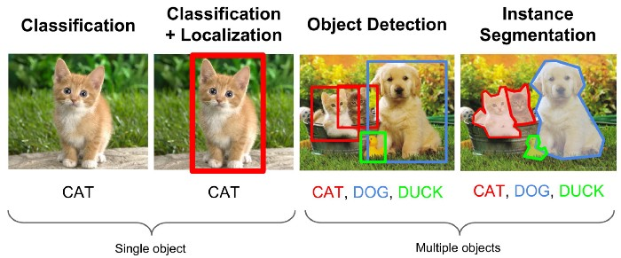

# R-CNN
이미지 처리 분야에서 다루는 문제들은 크게 3가지로 분류가 가능하다.
1. Classification
2. Object localizaion, Object detection
3. Segmentation

Classification의 경우, 이미지에서 하나의 객체의 카테고리를 판단하면 되는 문제이고, Object localization과 Object detection은 Classification 문제에 객체의 위치를 찾아 bounding box을 그려주는 문제이다. 여기서 localization과 detection는 객체의 갯수가 하나이냐 여러개이냐에 따라 문제가 분류된다. Segmentation의 경우, 여기에 한발짝 더 나아가서 객체의 경계를 정확히 찾아주는 문제이다. 아무래도 경계를 찾아야 되는 Segmetation 문제가 앞의 문제들 보다는 훨씬 어려운 문제임을 누구나 예상할 수 있다.
  

  
Object detection의 경우, 동작 방식에 따라 크게 두가지로 분류된다.
- 1-stage detection
- 2-stage detection  

이는 __객체가 있을 법한 위치 (Region of Interest, ROI)을 찾는 과정을 선제적으로 진행하느냐, 안하느냐__ 에 따라 분류되는데, 본 포스트에서 다룰 R-CNN 계열의 알고리즘은 바로 2-stage detection에 해당한다. R-CNN 계열은 __R-CNN__, __Fast R-CNN__, __Faster R-CNN__, __Mask R-CNN__ 등을 들 수 있는데, Segmentation 문제로 확장한 __Mask R-CNN__ 논외로 두고, 앞선 세 가지 알고리즘은 속도의 관점에서 지속적으로 개선이 된 경우이다. R-CNN을 시작으로 해서, 각각 어떤 특징이 있고, 어떠한 포인트를 기준으로 개선이 이루어졌는지 알아보도록 하자.

## 목차
- [R-CNN](#r-cnn,-2014)
- [Fast R-CNN](#fast-r-cnn,-2014)
- [Faster R-CNN](#faster-r-cnn,-2014)
- [Mask R-CNN](#mask-r-cnn,-2014)
  

## [R-CNN, 2014](https://arxiv.org/pdf/1311.2524.pdf) 